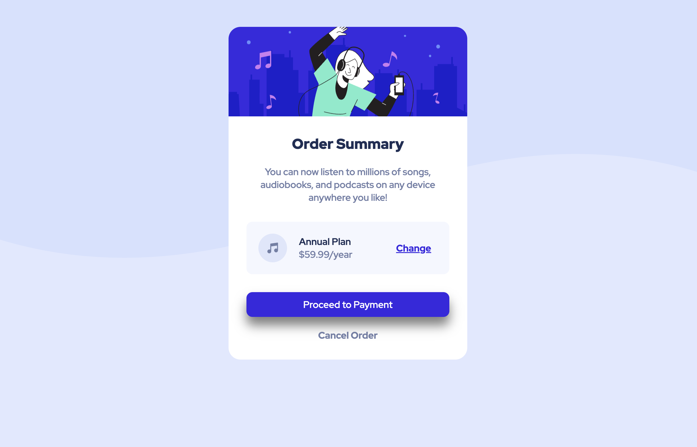

# Frontend Mentor - Order Summary Component

This is my solution to the **Order Summary Component** challenge on [Frontend Mentor](https://www.frontendmentor.io/challenges/order-summary-component-QlPmajDUj). It was built using only **HTML** and **CSS**, with a focus on semantic structure, responsive design, and visual accuracy.

## 🔗 Live Preview

[View on GitHub Pages](https://kopiika.github.io/frontend-mentor-order-summary-component/)

## 📸 Screenshot



---

## 🛠 Tools & Techniques Used

- Flexbox
- Mobile-first responsive design
- Google Fonts
- Semantic HTML
- Custom CSS (no frameworks)

---

## 💡 What I learned

As a beginner, I'm really proud that I was able to make the layout responsive and match the original design quite closely. It took me some time to get the spacing and structure right, but I learned a lot about using HTML and CSS more confidently.

---

## 🧩 Challenges I faced

- Aligning the **icon**, **plan details**, and **"Change" link** inside the pricing section. I solved this using `flexbox` and layout wrappers to separate concerns.
- Applying the **Google Font** consistently. I fixed this by assigning the font globally in the `body` selector.

---

## 🙋‍♀️ Feedback Welcome!

I'd love advice on:
- Improving **accessibility** (e.g., proper alt text, role attributes, semantic tags)
- **CSS class naming** and overall code structure
- Best practices for organizing styles in **larger/scalable projects**
- Any suggestions for subtle **UX or visual improvements**

---

## 📁 Folder Structure
```
order-summary-component/
├── images
├── index.html
├── style.css
└── README.md
```
---

## 📌 Attribution

Challenge by [Frontend Mentor](https://www.frontendmentor.io?ref=challenge)  
Coded by [Eleonora Kopiika](https://github.com/Kopiika)

